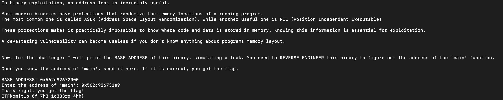
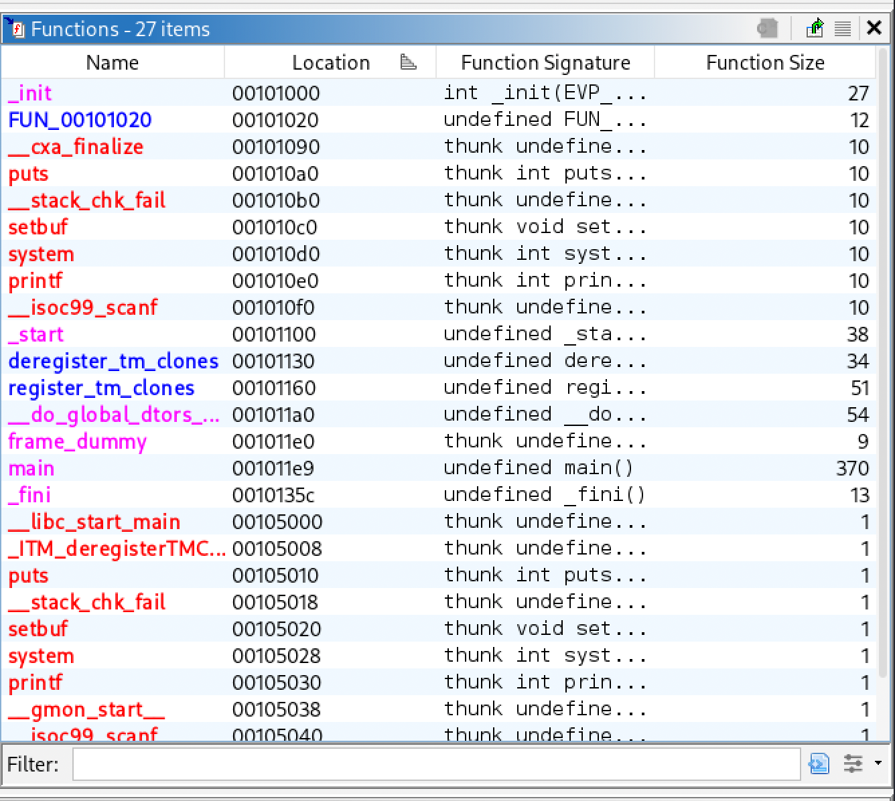
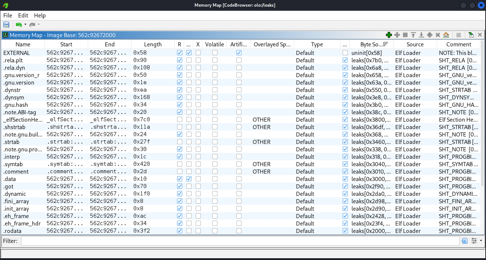

# Leaks

**Challenge:** *can you calculate the address??*

```
nc 10.212.172.46 6767
```

## Recon

The service prints an intro to ASLR/PIE, leaks the binary's base address, and asks for the runtime address of `main`.



The binary was provided. Loaded it into Ghidra — two ways to solve:

### Method 1 — Offset math

Ghidra's default image base is `0x100000`. `main` sits at `0x1011e9`, so the offset from base is `0x11e9`.



Add to the leaked base:

```
0x562c92672000 + 0x11e9 = 0x562c926731e9
```

### Method 2 — Rebase in Ghidra

Window → Memory Map → set Image Base to the leaked address. The Functions window now shows `main`'s real runtime address directly, no math.



## Gotcha

The base address **changes on every `nc` connection** — that is the whole point of ASLR. First attempt I computed a correct address, disconnected to double-check something, reconnected, and got told I was wrong. The leak is single-use per session: leak → calculate → submit, all in one connection.

## Flag

```
CTFkom{t1p_0f_7h3_1c383rg_4hh}
```

## Takeaway

PIE randomizes on every process start, so a leaked base is only valid for that connection. Never submit an address from a previous session.
