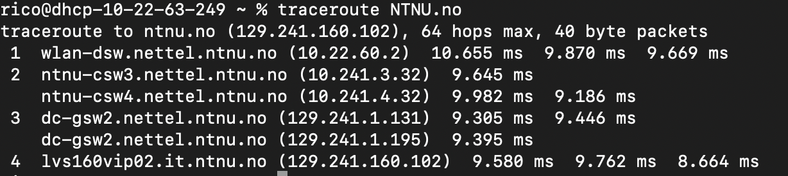

# Finding Routes — Second-Last Hop to NTNU.no

## Challenge

From the IP address `154.192.15.243` in Islamabad, reach `NTNU.no` and find the full domain name of the second-last hop of the journey.

**Flag format:** `FLAG{domain name only}`

## Recon

### Shortcut: the last two hops are source-independent

The destination IP is the same regardless of where the packet starts. Once traffic enters NTNU's own network and routes toward the LVS VIP, it has to traverse the same internal gateway — there's no alternative path inside the AS. So the second-last hop can be found by running traceroute locally.

```bash
traceroute NTNU.no
```

Second-last hop: `dc-gsw2.nettel.ntnu.no` — the datacenter gateway one hop upstream of `lvs160vip02.it.ntnu.no` (the LVS load balancer that terminates traffic for the site).



## Flag

`FLAG{dc-gsw2.nettel.ntnu.no}`

## Takeaway

The last hops of a traceroute converge inside the destination's own network — running locally works when the challenge asks about hops near the destination. For hops earlier in the path (source-dependent), use RIPE Atlas or a public looking glass in the required geography.
