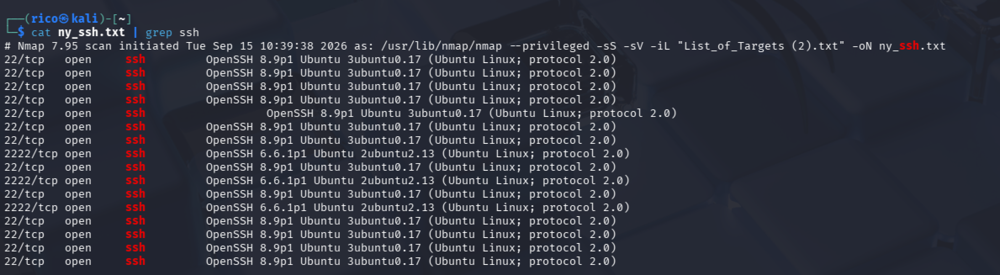

# SSH on Non-Standard Ports — Host Count and Version

## Challenge

From a list of targets, find how many are running SSH on non-standard ports. Report the count and the SSH version.

**Flag format:** `FLAG{count_sshVersion}` (example `FLAG{10_10.1.1}`)

## Recon

### Full port range with version detection

Default nmap only scans the top 1000 ports. SSH on port 2222/22222/etc. is invisible without `-p-`. Version detection (`-sV`) is also needed to identify SSH by banner rather than guessing from the port number.

```bash
sudo nmap -sS -sV -iL List_of_Targets.txt -oN ny_ssh.txt
```

`-sS` for SYN scan (needs sudo, faster and more reliable than the default TCP connect scan — the connect scan produced `tcpwrapped` false positives on earlier attempts).

### Filter for SSH

```bash
cat ny_ssh.txt | grep ssh
```

Most hosts run SSH on port 22 as expected. Three hosts also run it on `2222`:

```
2222/tcp open ssh OpenSSH 6.6.1p1 Ubuntu 2ubuntu2.13
2222/tcp open ssh OpenSSH 6.6.1p1 Ubuntu 2ubuntu2.13
2222/tcp open ssh OpenSSH 6.6.1p1 Ubuntu 2ubuntu2.13
```

Three hosts, all running OpenSSH 6.6.1p1.



## Flag

`FLAG{3_6.6.1p1}`

## Takeaway

Default nmap misses non-standard ports — always `-p-` when the challenge hints at obfuscation. `-sV` is what turns "open port" into "confirmed SSH banner"; without it, port 2222 could be anything. When TCP-connect scans return `tcpwrapped` on every port, switch to SYN scan (`sudo nmap -sS`) — the connect scan's three-way handshake completion is what triggers the tcpwrapped label on rate-limited or slow targets.
