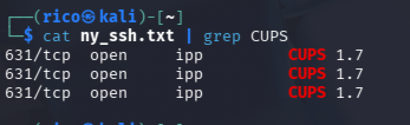

# CUPS Version in Target Range

## Challenge

Find the version of CUPS running in the target IP range.

**Flag format:** `FLAG{Portnumber_Version}` (example `FLAG{22_8.9}`)

## Recon

### Reuse the existing scan

The previous `sudo nmap -sS -sV -iL List_of_Targets.txt -oN ny_ssh.txt` scan captured every service on every host, not just SSH. Grepping the same file for CUPS returns the answer without a new scan.

```bash
cat ny_ssh.txt | grep CUPS
```

Three hosts, all running CUPS 1.7 on port 631 (the default IPP port):

```
631/tcp open ipp CUPS 1.7
631/tcp open ipp CUPS 1.7
631/tcp open ipp CUPS 1.7
```



## Flag

`FLAG{631_1.7}`

## Takeaway

One thorough scan, many answers. `sudo nmap -sS -sV -p- -iL <targets>` captures every service on every port — subsequent challenges become grep problems against the same output file, not new scans. Quieter on the network and faster to answer.

CUPS 1.7 is also worth noting for context: 2013-era, long EOL, and hit by CVE-2015-1158/1159 (privilege escalation and XSS in the web interface). If a follow-up challenge asks about vulnerabilities on this range, that's the pivot.
