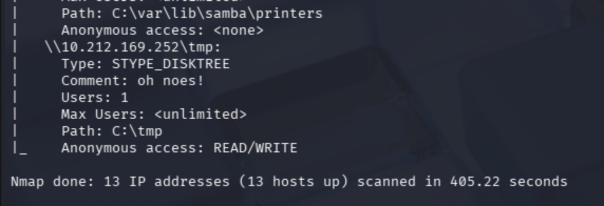

# Misconfigured Share — Guest Access via Samba

## Challenge

Some computers allow read/write access to shared folders over the network due to misconfiguration. Find which account is used for this via active scanning.

**Flag format:** `FLAG{AccountName_ServiceName}`

## Recon

### SMB share enumeration with nmap

Shared folders over the network usually mean SMB (ports 139, 445). nmap's `smb-enum-shares` script tests each share for anonymous read/write access:

```bash
sudo nmap --script smb-enum-shares -p 139,445 -iL List_of_Targets.txt
```

Scrolling through the output, one share stood out on `10.212.169.252`:

```
\\10.212.169.252\tmp:
    Type: STYPE_DISKTREE
    Comment: oh noes!
    Path: C:\tmp
    Anonymous access: READ/WRITE
```

Read AND write access with no authentication. The "oh noes!" comment is the challenge author's wink.



## Flag

`FLAG{guest_samba}`

## Takeaway

nmap labels unauthenticated SMB access as "Anonymous" because that is the protocol-level term, but the Samba server maps those connections to a real local account, `guest` (configured via `guest account = ...` in `smb.conf`). When a challenge asks "which account", the answer is what the server calls it, not what the wire protocol calls it — SMB is the protocol, Samba is the Linux implementation, and the account is a Samba concept.
