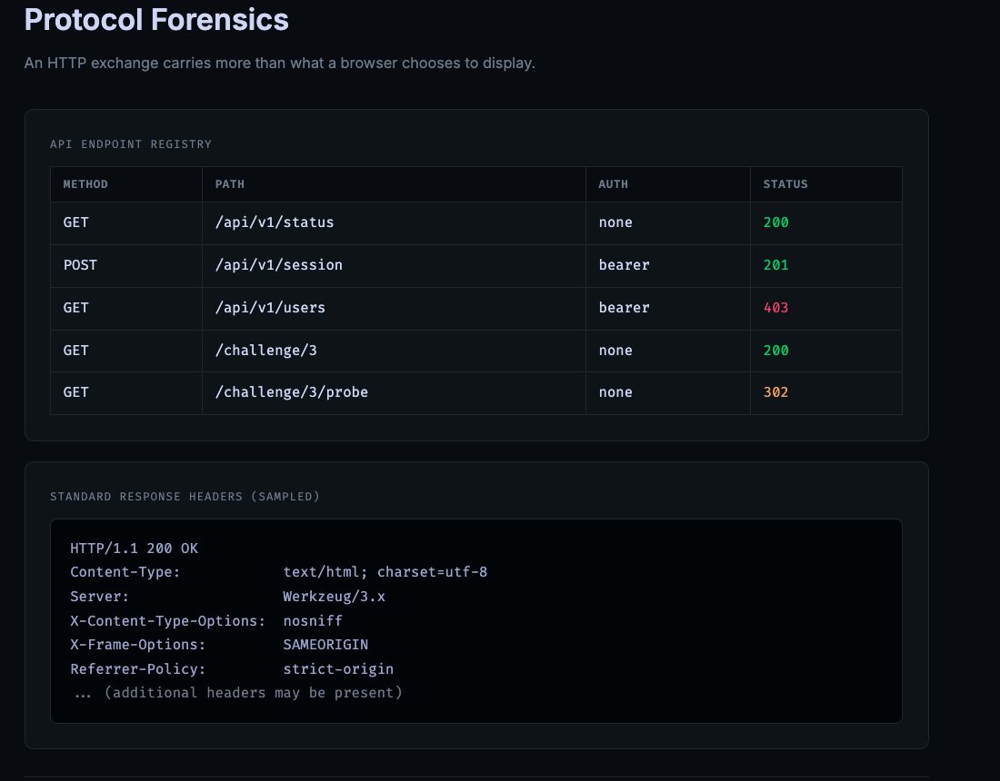
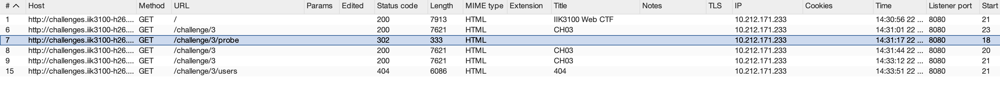
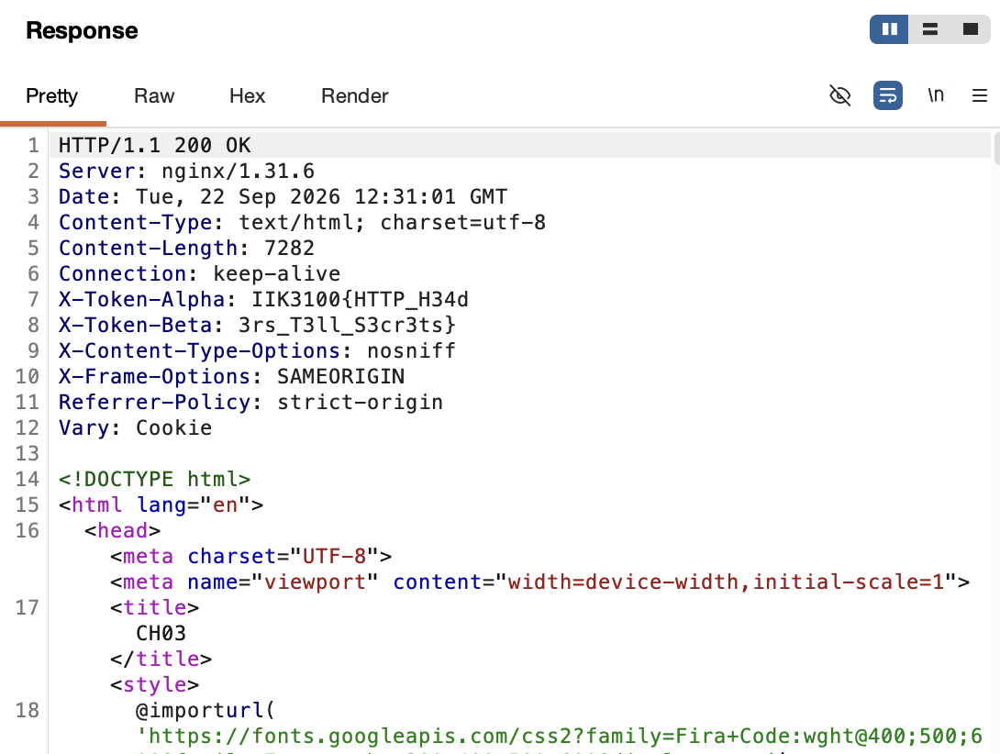

# Protocol Forensics

**Challenge:** *An HTTP exchange carries more than what a browser chooses to display.*

- `http://challenges.iik3100-h26.iaas.iik.ntnu.no:4001/` — sequential lock
- `http://challenges.iik3100-h26.iaas.iik.ntnu.no:4002/` — without sequential lock



## Recon

The page displayed an "API Endpoint Registry" listing five paths with mixed status codes:

| Path | Status | Auth |
|------|--------|------|
| `/api/v1/status` | 200 | none |
| `/api/v1/session` | 201 | bearer |
| `/api/v1/users` | 403 | bearer |
| `/challenge/3` | 200 | none |
| `/challenge/3/probe` | 302 | none |

This table was misdirection. The bearer-auth endpoints were dead ends (no token to hand over), and the whole registry pushed you to enumerate multiple targets. Ran everything through Burp anyway to look at the raw exchanges:



## Solve

The flag was in the response headers of `/challenge/3` — the challenge page itself, the one already open in the browser. Two custom headers past the standard set:



```
X-Token-Alpha: IIK3100{HTTP_H34d
X-Token-Beta:  3rs_T3ll_S3cr3ts}
```

Concatenated: `IIK3100{HTTP_H34d3rs_T3ll_S3cr3ts}`

## Flag

```
IIK3100{HTTP_H34d3rs_T3ll_S3cr3ts}
```

## Takeaway

The browser renders the response body, follows redirects silently, and hides response headers. Custom `X-*` headers, `Location` on redirects, `Set-Cookie` — none of it shows up unless you look at the raw exchange (DevTools Network tab, `curl -v`, or a proxy like Burp). Always check headers on web CTFs, even on pages you're already looking at.
