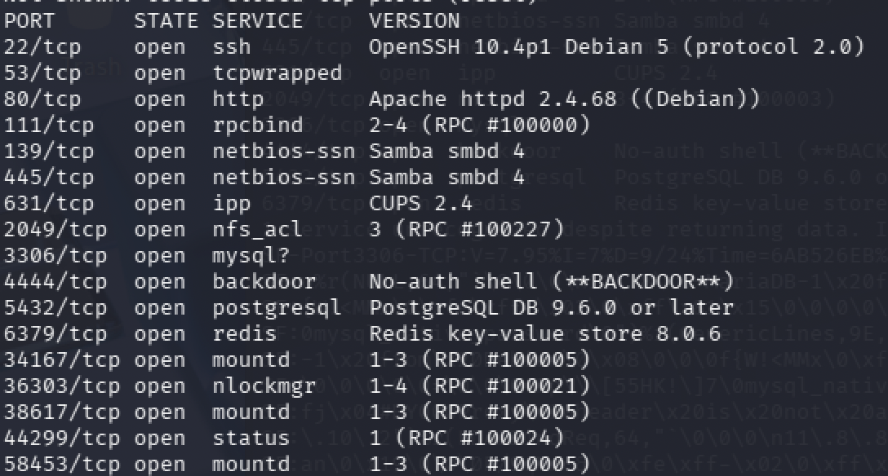
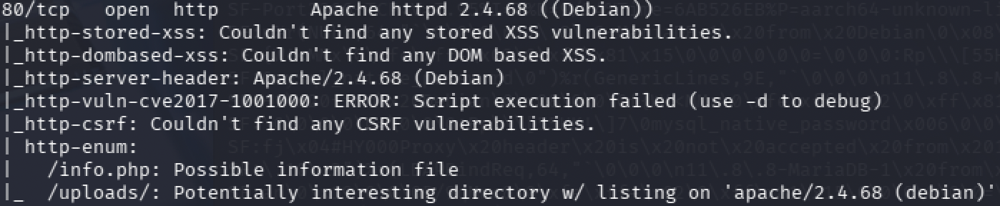
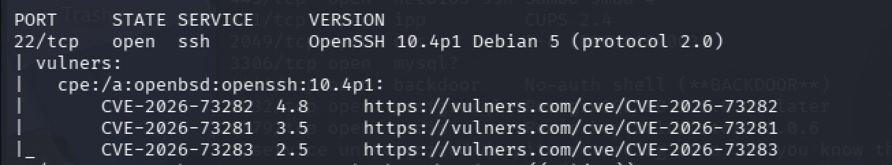
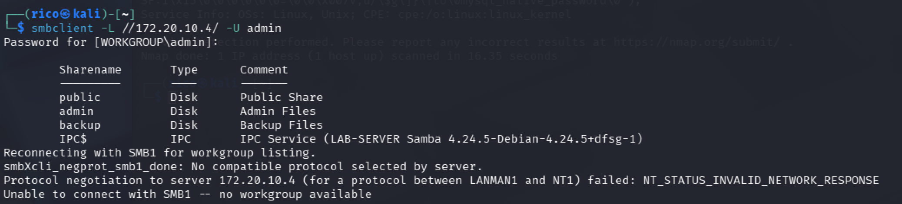
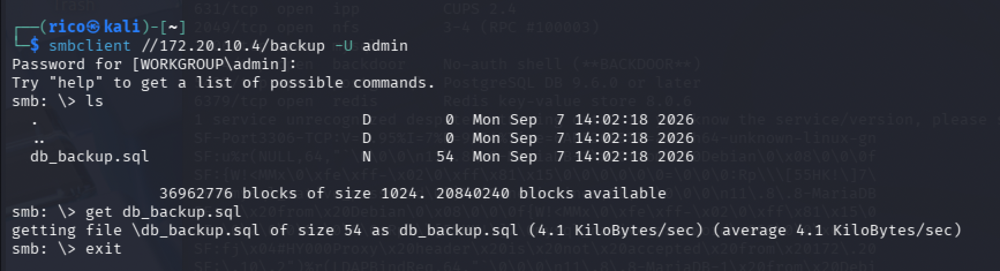
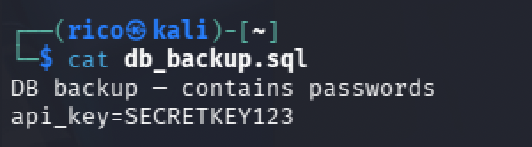
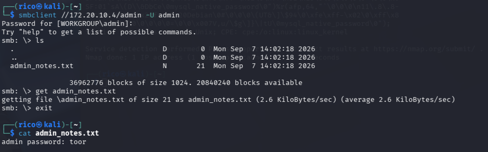
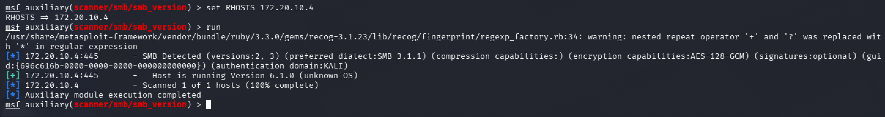
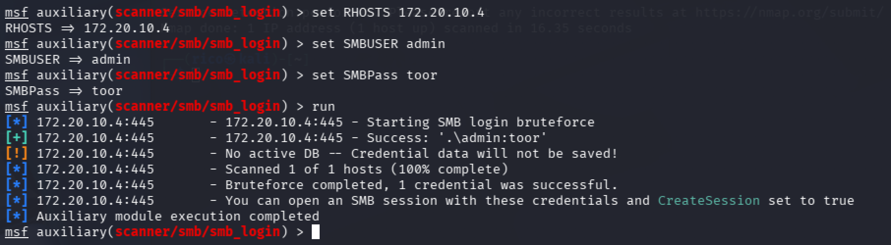
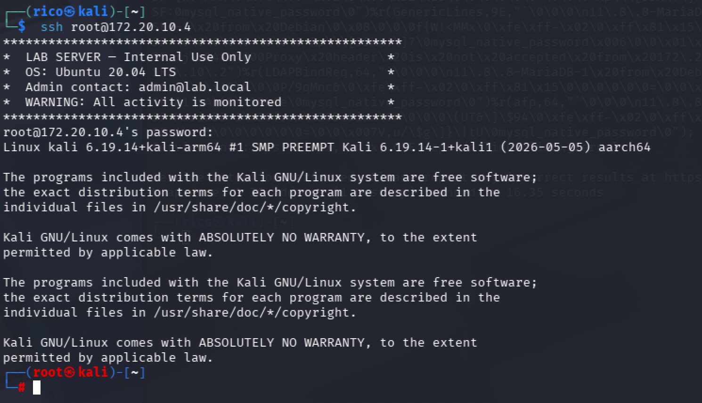

# Open-Box — VulnKali Lab (IIK3100 Home-Task Lab 4)

**Category:** Network / Pentest
**Target:** VulnKali VM (`172.20.10.4`)
**Result:** Remote root shell via leaked-and-reused credentials
**Flag:** `FLAG{openbox}`

---

## Challenge

A deliberately vulnerable "open-box" target running a spread of exposed
services (SSH, HTTP, Samba, NFS, databases, and a planted backdoor). The task:
full port scan → NMAP vulnerability scan → enumeration with NMAP and Metasploit
auxiliary modules → exploit at least one vulnerability for a remote shell →
document everything → submit `FLAG{openbox}`.

**Environment.** Attacker: Kali on VMware Fusion (Apple Silicon Mac). Target:
VulnKali in VirtualBox. On Apple Silicon, VirtualBox offers no host-only
adapter and bridging on campus Wi-Fi is unsafe (client isolation), so both VMs
were placed on **Bridged** over a phone hotspot (`172.20.10.0/28`), where they
reach each other. Note this subnet uses DHCP — the target's lease can change
across reboots, so the address is re-verified with a ping sweep before each
session rather than assumed.

---

## Recon

### Full port scan

Latency-bound scans crawl on default timing; forcing the packet rate turned a
full 65,535-port sweep into a ~2-minute job.

```bash
nmap -p- --min-rate 1000 -T4 172.20.10.4
```



| Port | Service | Version / Note |
|------|---------|----------------|
| 22 | ssh | OpenSSH 10.4p1 Debian |
| 53 | tcpwrapped | handshake completes then drops — deprioritised |
| 80 | http | Apache httpd 2.4.68 (Debian) |
| 111 | rpcbind | RPC #100000 (NFS portmapper) |
| 139 / 445 | netbios-ssn | Samba smbd 4 |
| 631 | ipp | CUPS 2.4 |
| 2049 | nfs_acl | NFS (RPC #100227) |
| 3306 | mysql | MariaDB 11.8.8 (Debian) |
| 4444 | backdoor | **No-auth shell (planted backdoor)** |
| 5432 | postgresql | PostgreSQL 9.6+ |
| 6379 | redis | Redis 8.0.6 |
| 34167 / 36303 / 38617 / 44299 / 58453 | mountd / nlockmgr / status | NFS RPC service cluster |

The high ports are not random — `rpcbind` (111) is the switchboard and
`mountd`/`nlockmgr`/`status` are the NFS services it points to. They hang
together as one NFS surface.

---

## Vulnerability scan

```bash
nmap -sV --script vuln --min-rate 1000 --script-timeout 60s \
  -p 22,80,111,139,445,631,2049,3306,4444,5432,6379 172.20.10.4
```

**HTTP (real findings — the scripts actively probed the server):**



- `http-enum: /info.php` — a probable `phpinfo()` information-disclosure page.
- `http-enum: /uploads/` — a directory-listing-enabled uploads folder (on a
  PHP host, a classic upload-to-RCE candidate).

**SSH (version-matched noise — treat with suspicion):**



`vulners` flagged CVE-2026-73281/82/83 against OpenSSH 10.4p1, all low severity
(CVSS 2.5–4.8). Critically, `vulners` matches on the **version banner alone** —
it never tests exploitability and cannot see Debian back-patches. These are
**unverified** and were not used.

**Analyst's note.** Signature-based scanning is good at flagging CVE'd software
versions but blind to *misconfigurations*. The two most impactful weaknesses on
this box — the no-auth `4444` backdoor and readable credentials in SMB shares —
were **not** surfaced by `--script vuln`; they were found by enumeration. That
contrast is the point: the vuln scan produced version noise on SSH/Samba while
the real path came from active enumeration.

---

## Enumeration (NMAP + Metasploit auxiliary)


### SMB share enumeration

```bash
smbclient -L //172.20.10.4/ -U admin
```



Three interesting shares plus the freebie in the IPC comment — the *exact* build,
**Samba 4.24.5-Debian**, and hostname **LAB-SERVER**:

| Share | Comment |
|-------|---------|
| public | Public Share |
| admin | Admin Files |
| backup | Backup Files |

### Hunting the credential source

**`backup` share** — pulled the DB dump and read it on the attacker box:




```
DB backup — contains passwords
api_key=SECRETKEY123
```

An API key — loot worth recording, but not a login password and not a direct
path to a shell.

**`admin` share** — the credential source:



```
admin password: toor
```

This closes the provenance: `toor` was **located on the box**, in
`admin_notes.txt` in the `admin` SMB share — not assumed. The `smb_login`
success earlier confirmed it works; this shows *where it leaked from*.

### Metasploit — `smb_version`

```
msf6 > use auxiliary/scanner/smb/smb_version
msf6 auxiliary(scanner/smb/smb_version) > set RHOSTS 172.20.10.4
msf6 auxiliary(scanner/smb/smb_version) > run
```



Pinned detail the nmap "Samba 4" banner couldn't: **SMB 2 + 3, preferred dialect
SMB 3.1.1, AES-128-GCM, signing *optional*, auth domain KALI.** Optional signing
is worth noting (relay attacks theoretically in scope).

### Metasploit — `smb_login` (credential validation)

Testing `toor` is a valid password:

```
msf6 > use auxiliary/scanner/smb/smb_login
msf6 auxiliary(scanner/smb/smb_login) > set RHOSTS 172.20.10.4
msf6 auxiliary(scanner/smb/smb_login) > set SMBUSER admin
msf6 auxiliary(scanner/smb/smb_login) > set SMBPass toor
msf6 auxiliary(scanner/smb/smb_login) > run
```



```
[+] 172.20.10.4:445 - Success: '.\admin:toor'
```

`admin:toor` **validated over SMB.** (`No active DB` is only a warning that loot
won't auto-save — not a failure.)


---

## Exploitation → Remote shell

The finding is **credential exposure + reuse**, not a software CVE. The chain:

1. Sensitive credential written in a readable SMB share (`admin_notes.txt`).
2. Weak, guessable password (`toor` = "root" reversed).
3. That password **reused across accounts** — and root SSH login permitted.

Testing reuse over SSH: `admin:toor` was rejected (the Samba user is not a
valid SSH login account). Testing the original `root:toor` hypothesis:

```bash
ssh root@172.20.10.4     # password: toor
```



```
(root㉿kali)-[~]
# 
```

**Root shell obtained** — highest privilege, via a credential enumerated and
sourced on the box, then reused against a service that never should have
accepted it directly.

> **Proof-of-root screenshot to add:** run `id; hostname; whoami` in the root
> session and capture `uid=0(root)` — the canonical evidence shot.

### Vulnerability classification

| Weakness | Class |
|----------|-------|
| Credentials in a readable share | CWE-522 Insufficiently Protected Credentials / CWE-200 Information Exposure |
| `toor` — trivially guessable | CWE-521 Weak Password Requirements |
| admin password == root password | Credential reuse (poor practice) |
| Password-based root SSH login enabled | CWE-250 / SSH misconfiguration |

**Secondary vector (not required, noted for completeness):** port `4444` is a
no-auth backdoor shell — `nc 172.20.10.4 4444` gives instant unauthenticated
access. Trivial, but unambiguously an exploitable planted vulnerability if a
Metasploit/CVE-style exploit is expected instead of the credential chain.

---

## Flag

```
FLAG{openbox}
```

Submitted to the CTF portal. The flag is the task-defined constant; obtaining
root is what earns the right to submit it.

---

## Takeaway

SSH did its job — nothing here is an SSH *exploit*. The compromise is a chain of
**human/configuration failures**, and breaking any single link stops it cold:

- A password should never be **written in a file** left readable in a share.
- That share should not expose sensitive files to a weak authenticated user.
- Passwords should not be **reused across privilege levels** (admin == root).
- **Root must not be directly SSH-able** with a password (`PermitRootLogin no`).

This is how real breaches usually look — misconfiguration and credential hygiene,
not zero-days. The lesson for a defender: the vulnerability scanner stayed quiet
on the actual attack path. Enumeration and credential hygiene review, not CVE
matching, are what would have caught this.

**Remediation:** remove secrets from shares; enforce strong, unique per-account
passwords; set `PermitRootLogin no` and use key-based auth; lock down SMB share
permissions; and remove the `4444` backdoor entirely.
