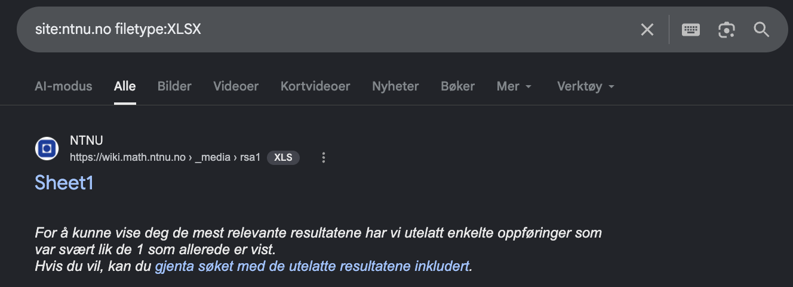
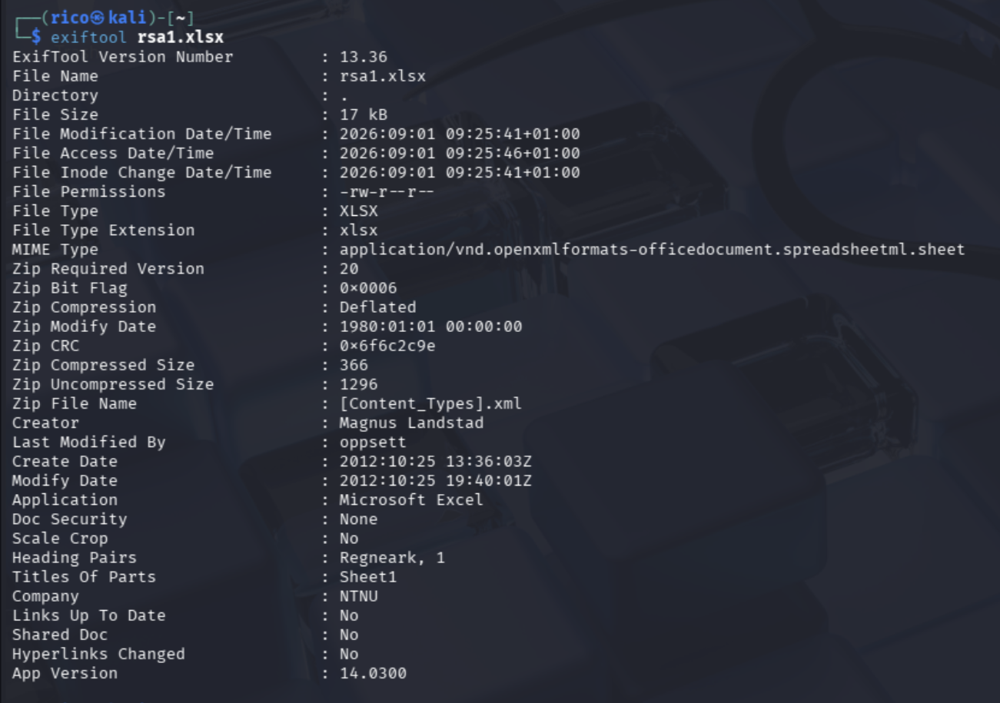

# NTNU — XLSX File Author

**Category:** OSINT / Metadata
**Flag format:** `FLAG{Author First Name Only}`

---

## Challenge

> Somebody left an XLSX file on NTNU domain, can you figure out the file author's name?

## Recon

Google dork for `.xlsx` files on the NTNU domain:

```
site:ntnu.no filetype:XLSX
```



One result: `https://wiki.math.ntnu.no/_media/rsa1.xlsx` — an old file sitting in the Math department wiki's media store.

## Extracting the author

`.xlsx` is a ZIP with XML metadata inside. `exiftool` reads it in one shot:

```bash
wget https://wiki.math.ntnu.no/_media/rsa1.xlsx
exiftool rsa1.xlsx
```



Key field:

```
Creator : Magnus Landstad
```

## Flag

```
FLAG{Magnus}
```

## Takeaway

- Office files (`.docx`, `.xlsx`, `.pptx`) are ZIP archives; author metadata lives in `docProps/core.xml`.
- `exiftool` is the fastest way to dump it. Old files (this one is from 2012) almost always still carry the creator's name.
