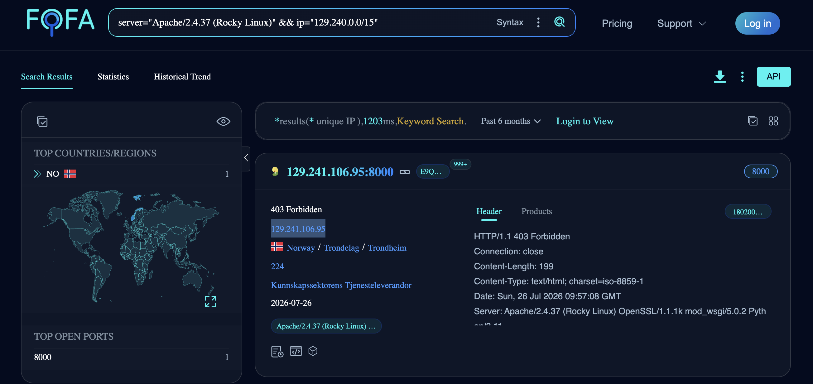

# Passive Host Discovery — Rocky Linux + Apache 2.4.37 on NTNU/UiO Range

## Challenge

Find the IP address of a host running Rocky Linux with Apache 2.4.37 inside the subnet `129.241.0.0/15`. No active scanning allowed — passive means only.

**Flag format:** `FLAG{IPAddress}`

## Recon

### Subnet decode

`129.241.0.0/15` normalizes to `129.240.0.0/15`, covering:
- `129.240.0.0/16` — UiO
- `129.241.0.0/16` — NTNU

### Fingerprint

Rocky Linux's httpd package brands the `Server` header as `Apache/2.4.37 (Rocky Linux)` — same convention as RHEL. That literal string is the pivot.

### Shodan and Censys

Both queried, both returned no relevant hits:

```
net:129.240.0.0/15 "Apache/2.4.37 (Rocky Linux)"
```

```
services.http.response.headers.server: "Apache/2.4.37 (Rocky Linux)" and ip: [129.240.0.0 to 129.241.255.255]
```

### FOFA

```
server="Apache/2.4.37 (Rocky Linux)" && ip="129.240.0.0/15"
```

One hit: `129.241.106.95:8000`, NTNU Trondheim, banner `Apache/2.4.37 (Rocky Linux) OpenSSL/1.1.1k mod_wsgi/5.0.2 Python/3.11`.



## Flag

`FLAG{129.241.106.95}`

## Takeaway

Aggregator diversity matters on two axes: **network coverage** and **port coverage**. Shodan's free-tier crawler under-samples high ports (this host was on 8000) — FOFA's wider default port spread surfaced it immediately.
