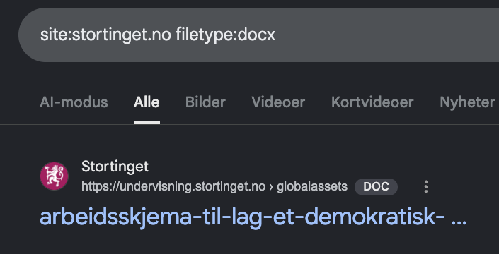
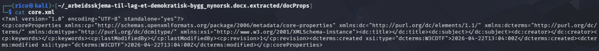
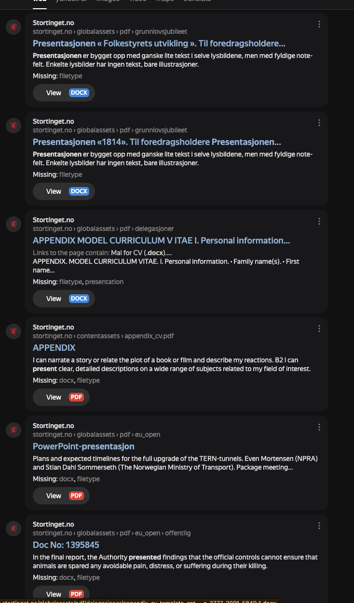
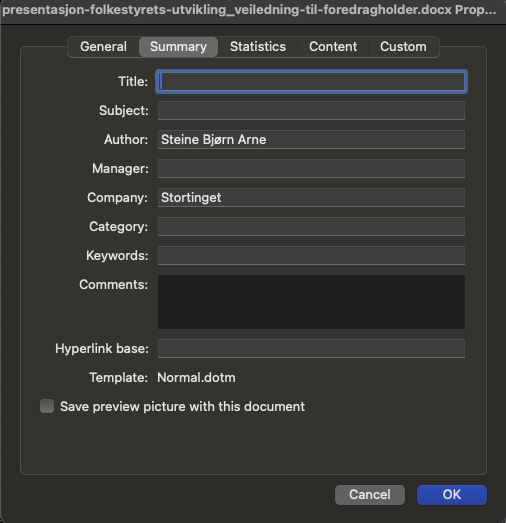

# Stortinget — Presentation DOC Author Email

**Category:** OSINT / Metadata + Search engine diversity
**Flag format:** `FLAG{email}`
**Flag:** `FLAG{bjorn.steine@stortinget.no}`

---

## Challenge

> There is a presentation DOC on stortinget.no, can you find the email of the document creator?

## First attempt — Google

Standard dork for Word docs on the target domain:

```
site:stortinget.no filetype:docx
```



Landed on `arbeidsskjema-til-lag-et-demokratisk-bygg.docx` — a worksheet from Stortinget's school outreach program. Downloaded it and pulled the metadata:

```bash
unzip arbeidsskjema-til-lag-et-demokratisk-bygg.docx -d extracted/
cat extracted/docProps/core.xml
cat extracted/docProps/app.xml
```

All author fields were **empty** — `<dc:creator></dc:creator>`, `<cp:lastModifiedBy></cp:lastModifiedBy>`, `<Company></Company>`.



The reason showed up in `word/settings.xml`:

```xml
<w:removePersonalInformation/>
<w:removeDateAndTime/>
```

Word was explicitly configured to strip personal info on save. Dead end on this file.

## Pivot — Yandex

Google's coverage of Norwegian government content is spotty; it de-prioritizes older files. **Yandex indexes `.no` government sites more aggressively.** Same style of search, different engine:



The top hit — `presentasjon-folkestyrets-utvikling_veiledning-til-foredragholder.docx` — was a "guide for presenters" document that Google hadn't surfaced.

## Extracting the author

Downloaded the file and opened Word's Properties → Summary tab (equivalent to reading `docProps/core.xml`):



```
Author  : Steine Bjørn Arne
Company : Stortinget
```

This file was **not** scrubbed — no `<w:removePersonalInformation/>` in its settings.

## Flag

Stortinget uses `firstname.lastname@stortinget.no`:

```
FLAG{bjorn.steine@stortinget.no}
```

## Takeaway

- **When Google says "no", try Yandex.** Different engines index different slices of the web — Yandex is especially strong for `.no`, older content, and government sites.
- **`<w:removePersonalInformation/>` in `settings.xml`** is the signal that a doc has been scrubbed. Pivot to a different file rather than grinding on internals.
