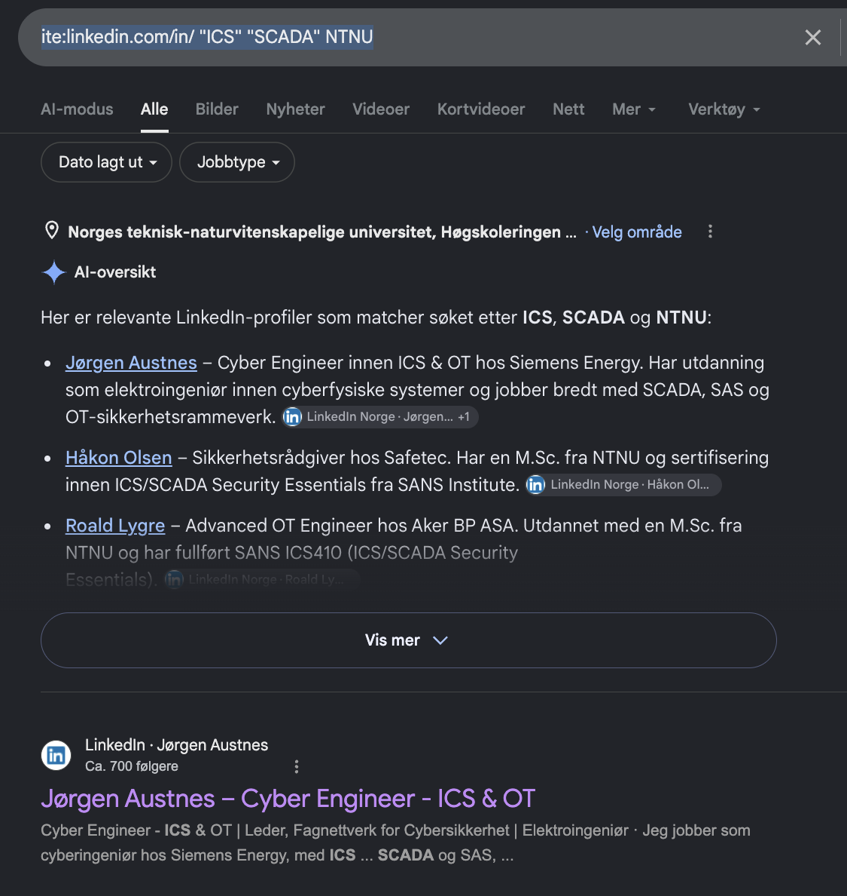

# LinkedIn — Norwegian ICS/OT Pentester

**Category:** OSINT / People search
**Flag format:** `FLAG{FirstNameOnly}`
**Flag:** `FLAG{Jørgen}`

---

## Challenge

> There is a hacker on LinkedIn who is from Norway doing penetration testing on ICS and SCADA and work on OT security and was affiliated with NTNU, can you find his name?

## Recon

LinkedIn's own search is gated by login state and network degree — Google is the actual recon interface for public LinkedIn profiles. The `site:linkedin.com/in/` filter restricts results to public profile pages.

Combined it with the challenge keywords:

```
site:linkedin.com/in/ "ICS" "SCADA" NTNU
```



Google's AI overview summarised three candidates matching all criteria (Norway, ICS/SCADA/OT, NTNU affiliation). The top organic result was **Jørgen Austnes** — Cyber Engineer for ICS & OT at Siemens Energy, NTNU background.

## Flag

```
FLAG{Jørgen}
```

## Takeaway

- **`site:linkedin.com/in/`** (with trailing slash) is the operator for finding LinkedIn profiles via Google. Cuts out job posts, company pages, and articles.
- Niche fields like Norwegian OT security have small talent pools — a few well-chosen keywords collapse the candidate set to a handful of people.
