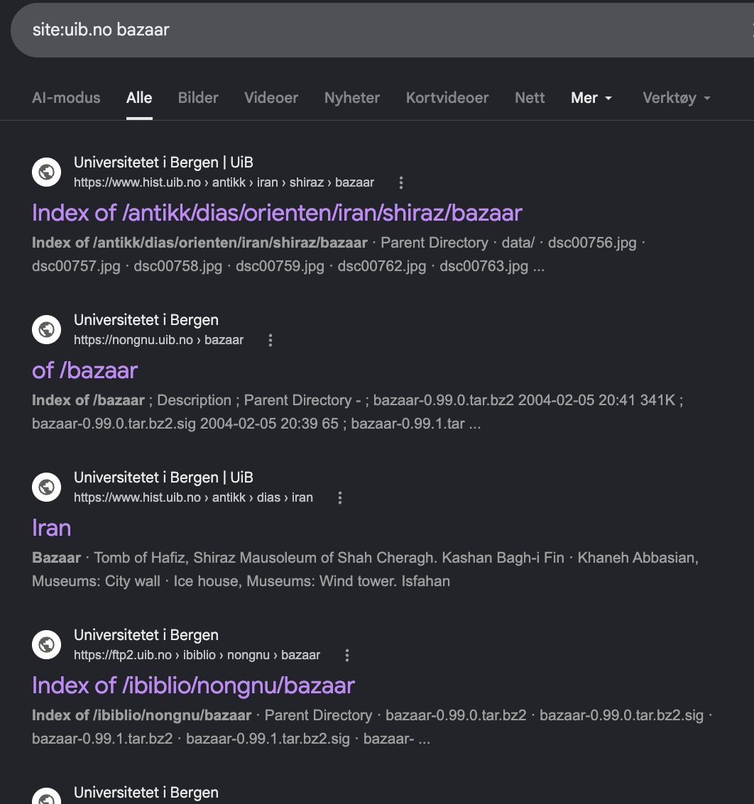

# UiB — The Forgotten Bazaar

**Category:** OSINT / Lateral thinking
**Flag format:** `FLAG{Full website address with Directory/, no https://}`

---

## Challenge

> I think UIB forgot a bazaar in Bergen can you find it?

## Recon

The word "bazaar" has two useful meanings here — a marketplace, and **GNU Bazaar**, a distributed version control system that's been effectively abandoned since ~2016. Both are worth checking.

Broad dork on the UiB domain:

```
site:uib.no bazaar
```



The 4th (`nongnu.uib.no/bazaar/`) is a directory listing full of `bazaar-0.99.0.tar.bz2`-style files dated **2004-02-05** — clearly an old mirror of the GNU Bazaar source releases that nobody's touched in 20+ years. `nongnu.uib.no` is UiB's mirror of nongnu.org (GNU's hosting for non-official-GNU projects).

### About `.bz2`

`.bz2` = **bzip2** compression, common for source-code tarballs in the early 2000s. `.tar.bz2` = a tarball compressed with bzip2. Mostly superseded by `.tar.gz` and `.tar.xz` today, but you'll still see it on old open-source archives — which is exactly what tipped this off as abandoned mirror content.

## Solving the pun

- **"UiB forgot a bazaar"** → UiB is still hosting the GNU Bazaar VCS source tarballs
- **"in Bergen"** → UiB = Universitetet i Bergen; the server is physically in Bergen
- **"forgot"** → 2004 tarballs, untouched for 20+ years

Flag is the URL, per format spec (trailing slash, no `https://`):

```
FLAG{nongnu.uib.no/bazaar/}
```

## Takeaway

- **Read challenge wording literally before technically.** "Bazaar" could have been the VCS tool (an exposed `.bzr/` directory would be the infosec-flavored answer), but the literal reading — a directory literally named `bazaar` — was correct.
- **Old file extensions and dates are OSINT signals.** `.tar.bz2` + 2004 = abandoned mirror. Fits "forgot" perfectly.
