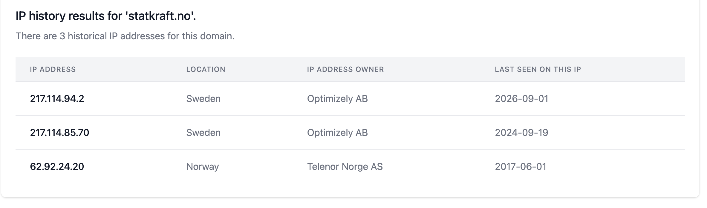
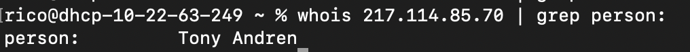

# Behind Cloudflare — Statkraft.no IP History and Registrant

## Challenge

`statkraft.no` is protected by Cloudflare. Find the domain's IP history and identify who registered it most recently.

**Flag format:** `FLAG{FirstNameOnly}`

## Recon

### Cloudflare hides the origin

Current DNS points to Cloudflare edge IPs — the real server IP is proxied. But historical DNS aggregators archive pre-Cloudflare resolutions.

### IP history via ViewDNS

`https://viewdns.info/iphistory/?domain=statkraft.no` returned three historical IPs. Most recent non-Cloudflare resolution: `217.114.85.70` (Optimizely AB, Sweden).



### RIPE whois on the IP

The word "registered" in the challenge refers to the IP block, not the domain. IPs are registered with a Regional Internet Registry (RIPE for Europe), and RIPE's `person:` field is not GDPR-stripped like Norid's whois.

```bash
whois 217.114.85.70 | grep person:
```

Returned: `person: Tony Andren`.



## Flag

`FLAG{Tony}`

## Takeaway

Three whois contexts to keep straight: TLD registry (domain name, GDPR-stripped on .no), RIR (IP block, `person:` still exposed), and passive DNS (the bridge that lets you pivot from a Cloudflare-fronted domain to a real IP and then to its RIR contact.)
