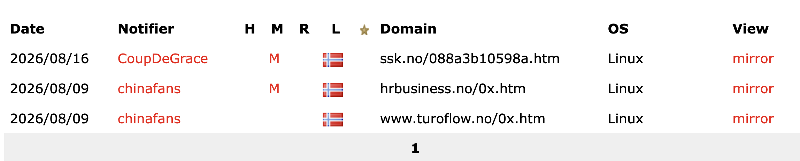

# Shared Hosting Compromise — Norwegian Site on 46.226.10.76

## Challenge

Find the domain name of a Norwegian website hosted on `46.226.10.76` (shared hosting) that was compromised in Week 33 of 2026.

**Flag format:** `FLAG{domain}` (no `https://`, no path)

## Recon

### Zone-H archive search by IP

Attackers submit defacements to public archives for credit. Zone-H is the largest such archive and supports filtering by IP.

`https://zone-h.org/archive` → filter by IP `46.226.10.76`.

Three defacements returned. Week 33 of 2026 = Aug 10–16, so only one falls in the window:

- `2026/08/16` — **ssk.no** — Week 33 ✓
- `2026/08/09` — hrbusiness.no — Week 32
- `2026/08/09` — turoflow.no — Week 32

Notifier for the Week 33 hit: `CoupDeGrace`.

## Flag

`FLAG{ssk.no}`

## Takeaway

Reverse-IP lookups just size the haystack; defacement archives (Zone-H, Mirror-H) are the shortcut that turns hundreds of shared-host domains into the one that was actually compromised. Read date constraints in the challenge as precise filters — Week 33 is the whole discriminator here.
