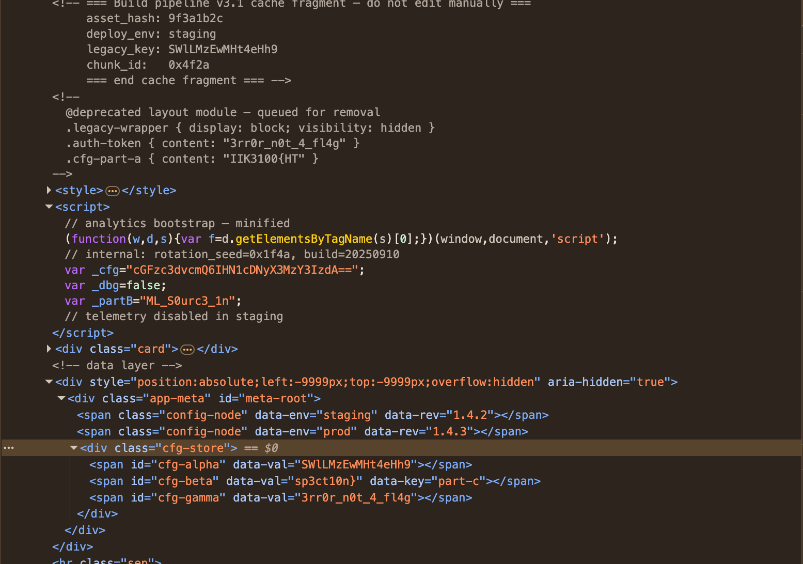

# Source Inspection

**Points:** 50
**Challenge:** *Locate data not rendered on the visible page.*


## Web

Opening DevTools revealed an off-screen hidden container:

```html
<div style="position:absolute;left:-9999px;top:-9999px;overflow:hidden" aria-hidden="true">
```

Inside it (plus in a CSS comment and a `<script>` block higher up), the flag was scattered as three parts:



## Assembling the flag

| Part | Location | Value |
|------|----------|-------|
| A | CSS comment: `.cfg-part-a { content: "..." }` | `IIK3100{HT` |
| B | JS variable: `var _partB="..."` | `ML_S0urc3_1n` |
| C | HTML attribute: `<span id="cfg-beta" data-val="..." data-key="part-c">` | `sp3ct10n}` |

Concatenated: `IIK3100{HTML_S0urc3_1nsp3ct10n}`

## Decoys

Several red herrings to ignore:

- `SWlLMzEwMHt4eHh9` (in `cfg-alpha` and as `legacy_key`) → base64 decodes to `IIK3100{xxx}`, the format placeholder from the challenge text
- `3rr0r_n0t_4_fl4g` in `.auth-token` and `cfg-gamma` — reads "error, not a flag"
- A `sup3r_s3cr3t` password decoded from another base64 string — pure flavor

## Flag

```
IIK3100{HTML_S0urc3_1nsp3ct10n}
```

## Takeaway

"Not rendered" ≠ "not sent." Everything in the DOM ships to the client — CSS `visibility:hidden`, off-screen positioning, and `aria-hidden` only affect display, not access. View source and DevTools reveal it all.
