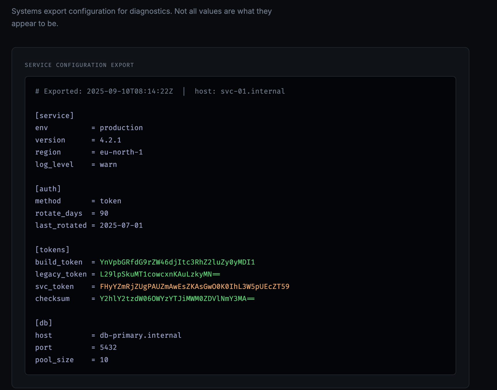

# Encoded Secret

**Points:** 50
**Challenge:** *A value has been transformed or rotated before storage.*

## Web

The page rendered a service config export with four base64-looking tokens in a `[tokens]` block:



Three tokens were green, one — `svc_token` — was **orange**. That visual difference was the "not all values are what they appear to be" hint the page warned about.

## Decoding each token

Straight base64 on each:

| Token | Base64 result | Notes |
|-------|---------------|-------|
| `build_token` | `build_token:v2-staging-2025` | Clean, no flag |
| `legacy_token` | `corp\admin:disabled` | Decoy — "disabled" account |
| `svc_token` | garbage bytes | ← the target |
| `checksum` | `checksum:9f3a2b1c4d5e6f70` | Clean, no flag |

`svc_token` had the right structure — length divisible by 4, only base64 alphabet characters — but decoded to nothing readable. That meant the plaintext had been transformed *before* being base64'd.

## The layered encoding

The challenge description was a direct hint: *"transformed or **rotated** before storage."* → ROT13.

Encoding pipeline:

```
plaintext → base64 → ROT13 → svc_token
```

To reverse, undo the operations in the opposite order — ROT13 first (it's its own inverse), then base64 decode:

```
FHyYZmRjZUgPAUZmAwEsZKAsGwO0K0IhL3W5pUEcZT59
    ↓ ROT13
SUlLMzEwMHtCNHMzNjRfMXNfTjB0X0VuY3J5cHRpMG59
    ↓ base64 decode
IIK3100{B4s364_1s_N0t_Encrypti0n}
```

## Flag

```
IIK3100{B4s364_1s_N0t_Encrypti0n}
```

## Takeaway

When a base64 string has valid structure but decodes to garbage, the plaintext was transformed **before** encoding. Try the classics first: ROT13, ROT-n brute force, reverse the string, XOR with a known key. And read the challenge text carefully — "rotated" almost always means a Caesar/ROT cipher.
