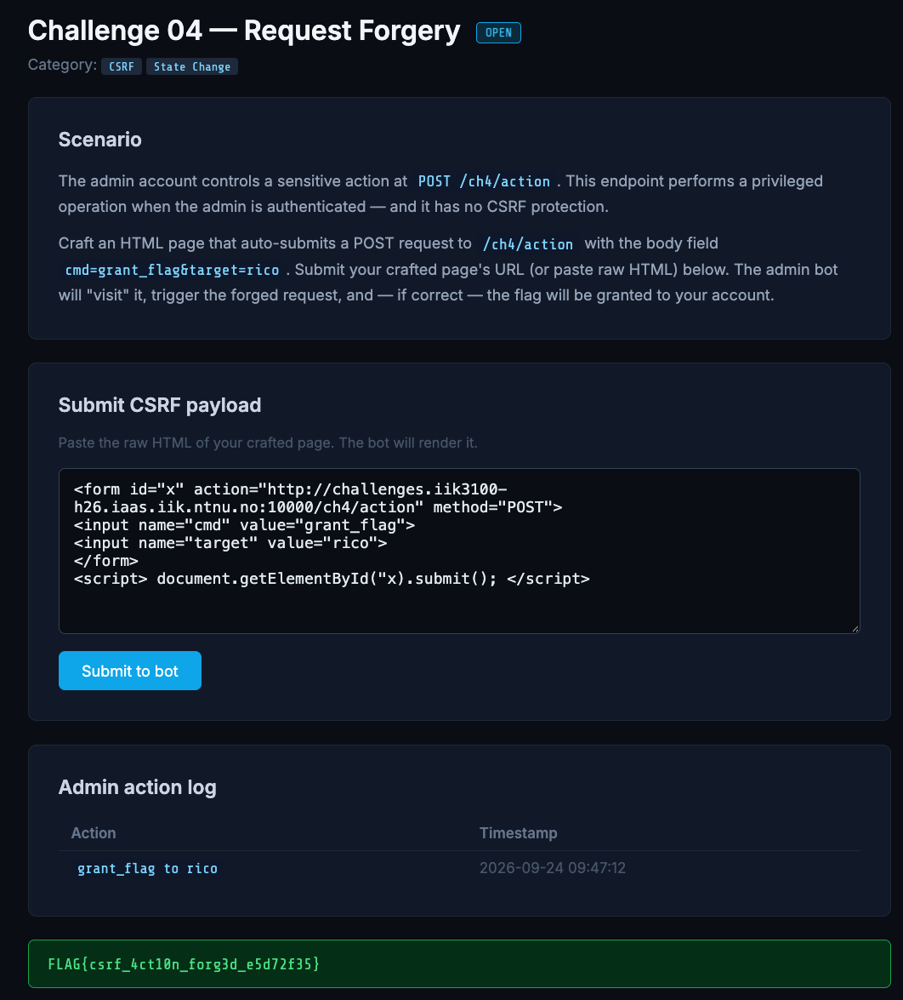

# Request Forgery (CSRF)

**Category:** CSRF / State Change
**Challenge:** *The admin controls a sensitive action at `POST /ch4/action`, which has no CSRF protection. Craft an HTML page that auto-submits `cmd=grant_flag&target=rico`; the admin bot visits it, triggers the forged request, and the flag is granted to your account.*


## Recon

The endpoint performs a privileged operation for the authenticated admin and has **no CSRF protection** — it doesn't verify the request originated from its own site. So any page the admin's browser loads can POST to it, and the browser will attach the admin's session cookie automatically. That is the whole mechanism of **Cross-Site Request Forgery (CSRF)**: the attacker never needs the cookie, only needs the victim's authenticated browser to send the request.

## Exploitation

An HTML page with a hidden form that auto-submits on load:

```html
<form id="x" action="http://challenges.iik3100-h26.iaas.iik.ntnu.no:10000/ch4/action" method="POST">
  <input name="cmd" value="grant_flag">
  <input name="target" value="rico">
</form>
<script> document.getElementById("x").submit(); </script>
```

- `action` points at the **challenge origin** (matching scheme and port), so the admin's cookie is in scope — `localhost` would resolve to the *bot's* own machine, not the server
- two hidden `<input>`s build the exact body `cmd=grant_flag&target=rico`
- the `<script>` sits **after** the form and fires `.submit()` on load — the bot never clicks anything

Two silent-failure bugs cost a first attempt: `cmd=flag_getter` (wrong string → server rejects, no error) and `getElementByID` (wrong casing → JS throws `not a function`, so the form never submits). Corrected to `grant_flag` and `getElementById`.

Paste the page; the bot renders it and its authenticated browser fires the POST. The admin action log records `grant_flag to rico` and the flag is granted:



## Flag

```
FLAG{csrf_4ct10n_forg3d_e5d72f35}
```

## Takeaway

The endpoint changed state on an authenticated request without checking that the request came from its own site — and a same-origin cookie can't defend that, since the browser attaches it to cross-site requests too. The fix is an **anti-CSRF token**: a per-session, unpredictable value the server issues and requires on every state-changing request, which a blind cross-site form can't read or supply. `SameSite` cookies and `Origin`/`Referer` checks back it up.
