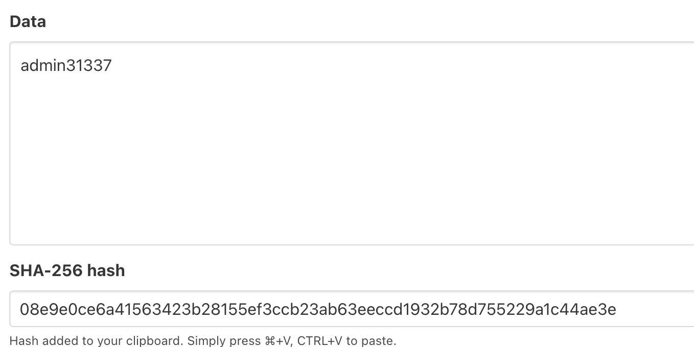
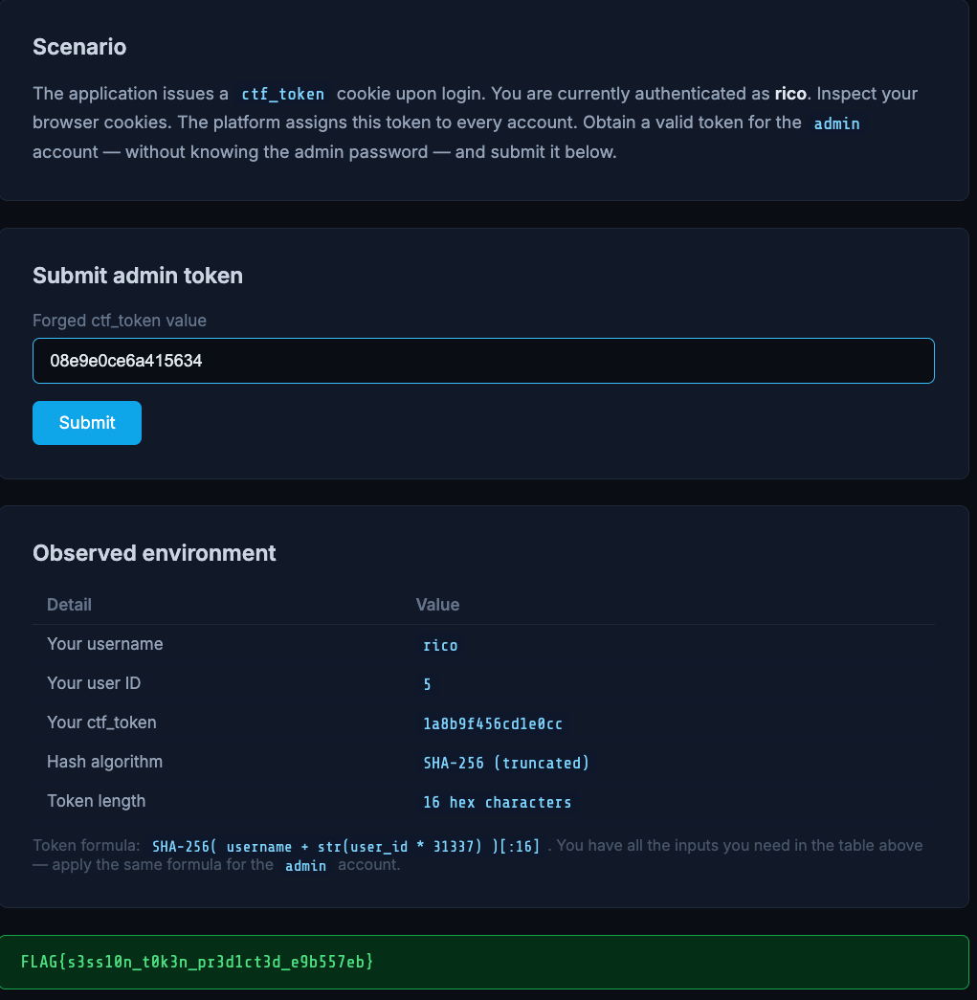

# Session Analysis

**Points:** 50
**Category:** Session Management / Access Control
**Challenge:** *Forge the `ctf_token` cookie for the `admin` account and submit it — without knowing the admin password.*


## Recon

My `ctf_token` is a 16-char hex string (`1a8b9f456cd1e0cc`) — no dots, no base64 JSON, so it's an opaque token, not a JWT. 16 hex chars = 8 bytes = 64 bits.

Re-authenticating gives the **same** token every time → it's deterministic, computed from the account rather than random session state. That means it's reproducible offline by anyone who knows the recipe.

The environment leaks a matched pair (my account fields → my token) and the algorithm:

```
ctf_token = SHA-256( username + str(user_id * 31337) )[:16]
```

8 bytes is exactly the first half of a SHA-256 digest — a truncated hash — and every input is public.

## Exploitation

Verify the formula against my own token, then apply it to `admin` (`username=admin`, `id=1` → `"admin31337"`):



```
SHA-256("admin31337") = 08e9e0ce6a415634 23b28155ef3ccb23ab63eeccd1932b78d755229a1c44ae3e
                        └── ctf_token ──┘ └──────────── discarded by [:16] ───────────┘
```

Set `ctf_token=08e9e0ce6a415634` and submit → authenticated as admin, flag revealed:



## Flag

```
FLAG{s3ss10n_t0k3n_pr3d1ct3d_e9b557eb}
```

## Takeaway

The token was a pure function of public fields (username + a trivially transformed sequential ID), so anyone could recompute anyone's. Session tokens must be unpredictable — random from a CSPRNG, or `HMAC-SHA256(server_secret, …)` where the secret blocks reproduction — and never truncated to 64 bits.
