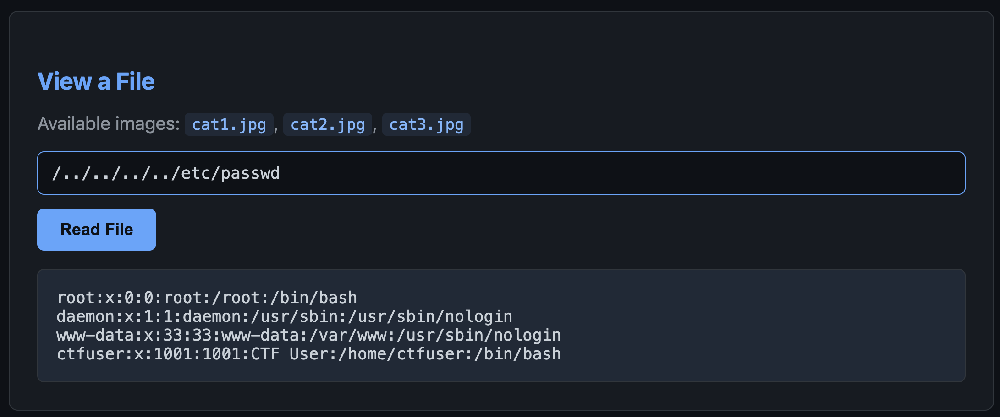
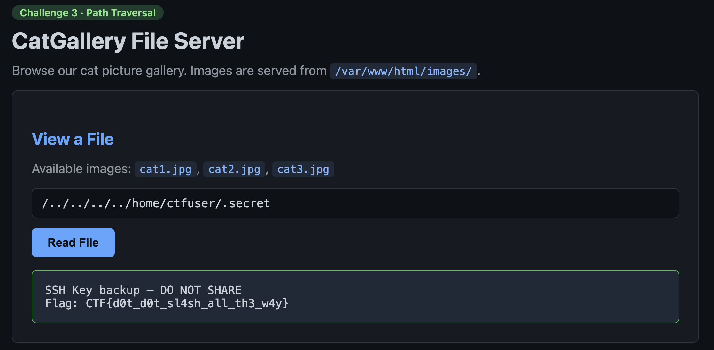

# Challenge 3 — Path Traversal (CatGallery File Server)

**Vulnerability:** Path Traversal (CWE-22)

## The Bug

The "View a File" feature reads images from `/var/www/html/images/`. It glues
your input onto that path and reads the file — with no check that you stay
inside the folder. So `../` lets you climb out and read anything.

## Exploit

**1. Confirm traversal — read `/etc/passwd`:**

```
../../../../etc/passwd
```



This proves it works and leaks local users. `ctfuser` has a real home at
`/home/ctfuser` — good next target.

**2. Grab the secret from the user's home:**

```
../../../../home/ctfuser/.secret
```



## Fix

Resolve the path first, then check it's still inside the images folder:

```python
import os
BASE = "/var/www/html/images"

def safe_read(user_input):
    requested = os.path.realpath(os.path.join(BASE, user_input))
    if os.path.commonpath([requested, BASE]) != BASE:
        raise PermissionError("blocked")
    return open(requested, "rb").read()
```

Checking the raw string for `../` isn't enough — encoded forms like `%2e%2e%2f`
slip past. Resolve the real path and compare.
